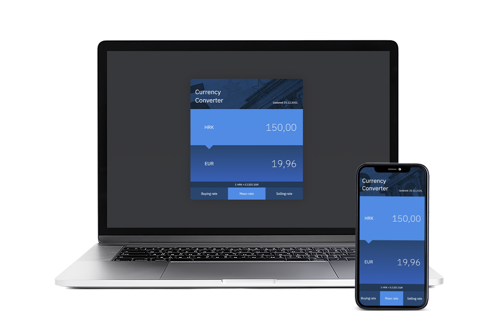

## PWA | Currency Converter App
Simple progressive web app for converting Croatian kuna to European euro currency. Build using HTML5, CSS3 and Vanilla JS to fetch API data from [Croatian National Bank](https://www.hnb.hr/).

### Built Using
- [x] HTML5
- [x] CSS3
- [x] Vanilla JS

### ToDo List
- [ ] Update ServiceWorker to cache/fetch assets

### App Preview

### Links
- Live Site URL: [Live Solution Preview](https://btopolnjak.github.io/pwa-currency-converter/)
- Website - [Boris Topolnjak](https://github.com/btopolnjak)
- LinkedIn - [@boris-topolnjak](https://www.linkedin.com/in/boris-topolnjak-23334b104/)